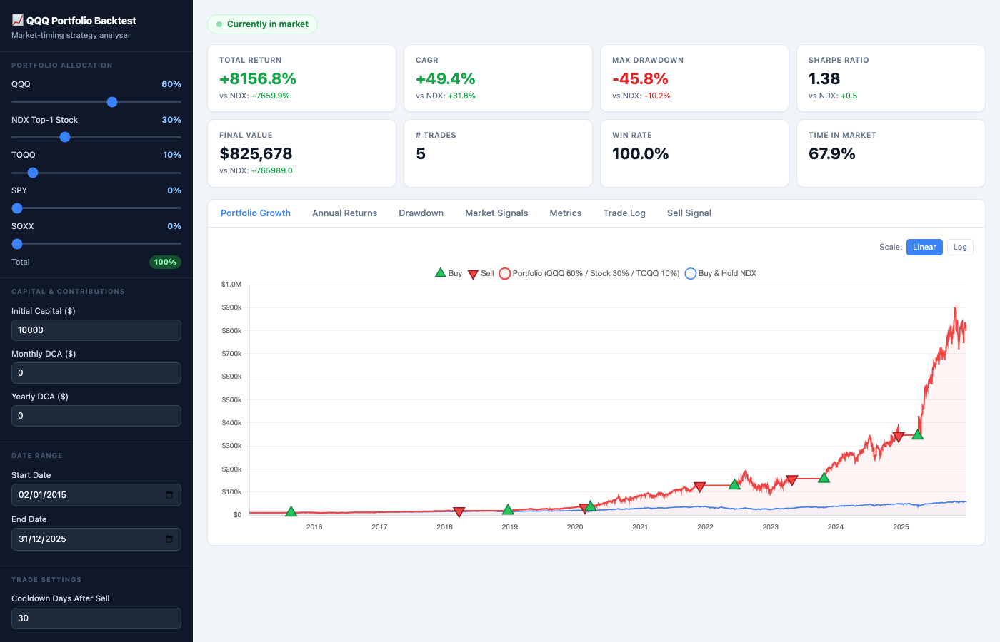

# QQQ Portfolio Backtest

A market-timing backtest engine for NASDAQ-heavy portfolios (QQQ, TQQQ, NDX top stock, SPY, SOXX), with both a Python CLI and an interactive static web app deployable to GitHub Pages.



## Live Demo

**[Try it on GitHub Pages →](https://wongkaho2626.github.io/spy500-breadth-backtest/)**

## How It Works

The strategy uses the **S&P 500 breadth indicator** — the percentage of S&P 500 stocks trading above their 200-day moving average — as a market-health signal to time entries and exits.

### Entry (go to market)

All three conditions must be true simultaneously:

1. **Breadth < 26%** — fewer than 26% of S&P 500 stocks are above their 200-day MA, signalling a broadly oversold market
2. **Vote gate passes** — either VIX > 30 (elevated fear) OR the NDX index is above its own 200-day MA; this avoids buying into a structurally broken trend
3. **Cooldown has expired** — a user-configurable number of days (default 30) must have passed since the last exit, preventing immediate re-entry after a whipsaw

When a buy fires, any accumulated cash contributions are swept into the portfolio before purchase. A **$1 commission + 0.05% slippage** is applied to the effective entry price.

### Exit (bearish divergence)

The strategy exits when all three divergence conditions are met within the same 60-day lookback window:

1. **NDX price rose ≥ 3%** over the past 60 trading days — the index kept climbing…
2. **Breadth fell ≥ 20 percentage points** over the same window — …but the average stock weakened underneath
3. **Breadth is currently below 60%** — overall market health is not yet overbought enough to ignore the divergence

This combination flags a narrowing rally — the index is being carried by a shrinking number of stocks, historically a precursor to a correction. The same slippage and commission costs apply on exit.

### Portfolio structure

Capital is split across up to five assets according to user-defined weights:

| Slot | Asset | Description |
|------|-------|-------------|
| QQQ | NASDAQ-100 ETF | Core holding |
| NDX Top-1 Stock | Largest NDX constituent that year | Concentration bet on the market leader |
| TQQQ | 3× leveraged NDX ETF | Optional leverage |
| SPY | S&P 500 ETF | Diversifier |
| SOXX | Semiconductor ETF | Sector bet |

If price data is unavailable for an asset on a given date, its allocation is automatically folded into QQQ. When out of the market, capital sits uninvested in per-asset cash buckets, ready for the next entry.

### DCA contributions

Monthly and/or yearly contributions accumulate in a cash reserve while out of market, then are swept proportionally into all buckets at the next buy signal.

The web app runs all of this logic entirely in the browser — no server required.

## Web App Features

- Adjustable portfolio allocation across QQQ / NDX Top-1 Stock / TQQQ / SPY / SOXX
- Initial capital + monthly/yearly DCA contributions
- Custom date range and post-sell cooldown period
- Charts: Portfolio Growth, Annual Returns, Drawdown, Market Signals
- Metrics: Total Return, CAGR, Max Drawdown, Sharpe Ratio, Win Rate, Time in Market
- All compared against a Buy & Hold NDX benchmark

## Running Locally

### Web App

```bash
cd webapp/nextjs
npm install
npm run dev     # http://localhost:3000/spy500-breadth-backtest
```

### Python Backtests

```bash
# SPY breadth strategy
python spy_backtest.py

# QQQ breadth strategy (with trailing stop)
python qqq_backtest.py

# S&P 500 breadth strategy
python backtest.py

# Seeking Alpha annual picks comparison
python seeking_alpha_backtest.py

# Parameter grid search
python spy_optimize.py
python qqq_optimize.py
```

Each script prints a metrics table and trade log to stdout, and saves a chart PNG.

## Data Files

All CSVs use `MM/DD/YYYY` dates and comma-formatted prices. Place them in the project root for the Python scripts, and in `webapp/nextjs/public/data/` for the web app.

| File | Used by |
|------|---------|
| `SPY ETF Stock Price History.csv` | `spy_backtest.py`, `spy_optimize.py` |
| `QQQ ETF Stock Price History.csv` | `qqq_backtest.py`, `qqq_optimize.py` |
| `S&P 500 Historical Data.csv` | `backtest.py` |
| `S&P 500 Stocks Above 200-Day Average Historical Data.csv` | all scripts |
| `seeking_alpha.csv`, `SPX.csv`, `S&P500ForwardPE.csv`, `S5TH.csv`, `VIX.csv` | `seeking_alpha_backtest.py` |

## Deployment

Pushing to `main` automatically builds the Next.js app and deploys to GitHub Pages via `.github/workflows/deploy.yml`.
